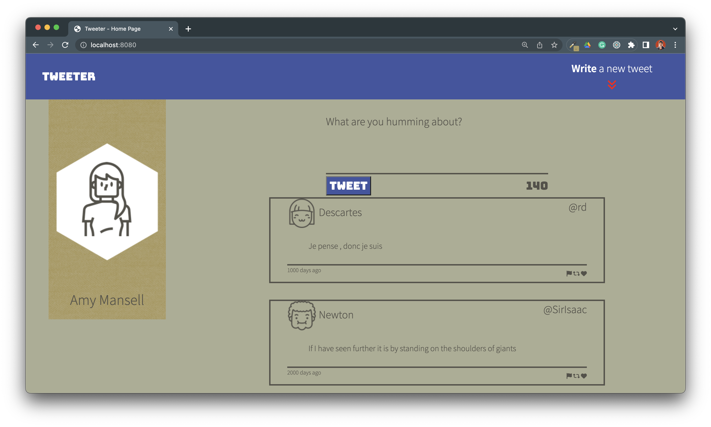

# Tweeter Project

Tweeter is a simple, single-page Twitter clone. This project was developed as 
part if of Lighthouse Labs Bootcamp.

The technologies used are the following:

- HTML
- CSS
- JS
- jQuery
- AJAX

## Final Product

## Getting Started

1. [Create](https://docs.github.com/en/repositories/creating-and-managing-repositories/creating-a-repository-from-a-template) a new repository using this repository as a template.
2. Clone your repository onto your local device.
3. Install dependencies using the `npm install` command.
3. Start the web server using the `npm run local` command. The app will be served at <http://localhost:8080/>.
4. Go to <http://localhost:8080/> in your browser.

## Dependencies

- Express 4.18.2
- Node 5.10.x or above
- Body-parser 1.15.2
- Chance 1.0.2
- Javascript-time-ago 2.5.9
- Md5 2.1.0
- Nodemon 1.9.2
